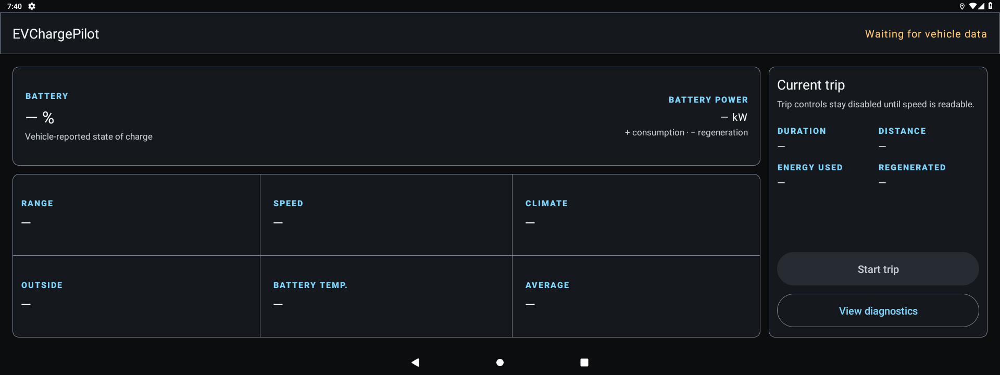
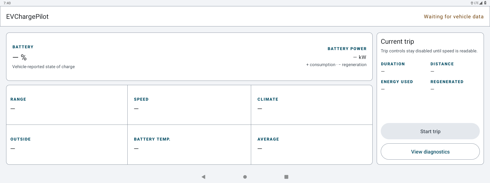

# EVChargePilot

[](https://github.com/malys/EVChargePilot/actions/workflows/tests.yml)
[](https://github.com/malys/EVChargePilot/actions/workflows/security.yml)
[](https://github.com/malys/EVChargePilot/releases)
[](LICENSE)

Read-only live energy dashboard and local trip analyser for the SAIC MG4 head unit.

<p align="center">
  
  
</p>

> ⚠️ **No warranty, no liability.** Telemetry may be wrong, delayed or unavailable. Never
> use this app as the sole basis for a range or charging decision. See [DISCLAIMER.md](DISCLAIMER.md).

## Contents

- [Overview](#overview)
- [Features](#features)
- [Requirements](#requirements)
- [How it works](#how-it-works)
- [Trip export formats](#trip-export-formats)
- [Install](#install)
- [Configuration](#configuration)
- [Building](#building)
- [Project layout](#project-layout)
- [Project documents](#project-documents)
- [Security](#security)
- [Contributing](#contributing)
- [Legal](#legal)

## Overview

EVChargePilot is an offline EVSuite application for Android Automotive OS 9. It reads typed,
firmware-aware vehicle capabilities from EVHardware and renders unavailable readings as `—`.
It does not write to the vehicle and does not contain network or update code.

## Features

- Vehicle-reported SOC and range.
- A grouped thermal/climate state block: outside, cabin and evidence-gated battery
  temperatures; HVAC, AC, auto, econ and recirculation states; fan level/maximum; and
  driver/passenger targets when each signal is available.
- Automatic trip detection plus parked-only manual controls and configuration.
- Distance and duration calculated locally.
- Evidence-gated signed battery power with a static traction/regeneration scale.
- Pack temperature and charging state when exposed by the current firmware.
- Energy and regeneration integration from the shared EVHardware power convention.
- Parked-only, bounded diagnostic/evidence ZIP to an explicitly chosen removable USB volume.
- Atomic, app-private trip history and in-app crash diagnostics.

Every signal remains best-effort: unsupported or unreadable properties are displayed as `—`,
never zero. Arrival SOC, charger routing and energy-source attribution remain outside this
initial milestone.

## Requirements

- SAIC MG4 head unit running Android Automotive OS 9 or a compatible test device.
- Android API 28 or newer.
- Platform signing for privileged car-property permissions where required by the firmware.

## How it works

EVHardware's `EnergyTelemetryReader` produces one coherent nullable snapshot per second.
Battery power is not integrated into normal trip history, and every dashboard calculation
derived from it remains unavailable, until the checked-in evidence catalogue validates the
signal's scale and sign on that exact firmware generation. A trusted energy summary stores the
exact firmware and conversion version as a small metadata tag; legacy and mismatched totals are
excluded from adaptive models. The bounded unstable CP-003 recorder is the separate raw-evidence
path used to establish that validation. It stores aggregated signal statistics rather than a raw
sample stream and retains only the eight newest app-private JSON files.
The dashboard states `+` battery output and `−` regeneration/charging in text as well as on a
static centred scale; it never animates that passive display while driving.
The thermal/climate block is likewise passive and keeps each field independently nullable, so a
firmware that publishes only part of the climate snapshot still shows the usable readings and an
explained `—` for every gap. Battery temperature remains hidden as unvalidated until CP-003 proves
its unit and semantics for the exact firmware generation. HVAC and AC indicators describe state
only: the vehicle has not supplied an HVAC power measurement, and the app does not infer one.
Its shared `TripDetector` starts after five continuous seconds at or above 5 km/h and stops
after 120 continuous seconds at or below 1 km/h, with park or charge-port confirmation when
either signal exists. Missing speed and observation gaps over five seconds invalidate partial
evidence rather than inventing a boundary. `EnergyTripAccumulator` likewise rejects integration
gaps longer than five seconds, and `EnergyTripHistoryStore` writes a bounded history through a
unique temporary file and atomic rename.

Automatic detection is enabled by default. A foreground service owns the sampler so detection
and recording continue when the driver opens another app. On firmware where speed stays
unavailable, ten consecutive misses suspend idle background polling; opening the dashboard
performs a bounded retry. Active trips remain fail-closed and under manual control. A trip's
reported duration is the time actually covered by usable samples, not wall clock: a suspended
sampler adds nothing to duration, distance or energy, so consumption averages compare values
measured over the same interval.

The diagnostics dialog exports one self-contained ZIP to a removable USB volume: runtime/APK and
signer identity, exact firmware, service and last-sample state, property/provenance probes,
bounded recent log, previous crash, and up to eight newest unstable CP-003 evidence JSON files.
Its manifest records byte counts and SHA-256 per artifact. The app offers only removable roots
already visible at runtime and can fall back only to its own folder on that same USB volume; it
never falls back to internal AAOS storage and declares no storage permission. Export requires a
fresh readable speed at or below 0.1 km/h, runs off the main thread, caps the text report at
128 KiB, each evidence file at 64 KiB and the ZIP at 768 KiB, then atomically renames a synced
temporary file on USB. No archive copy accumulates on AAOS.

## Trip export formats

The trip history can export one trip or the full bounded ledger without network or storage
permission. Exports are written atomically under the app-private `files/exports/` directory;
the completed absolute path is shown in the app for an explicit `adb pull`. **Share file** opens
Android's chooser with temporary read access to that one file through `FileProvider`.

CSV contains summary rows only, in this exact order:

```text
started_at_utc,ended_at_utc,recorded_duration_seconds,distance_km,start_soc_percent,end_soc_percent,consumed_kwh,regenerated_kwh,average_consumption_kwh_per_100km,battery_power_firmware,battery_power_conversion_version
```

Times are ISO-8601 UTC, duration is seconds, distance is kilometres, SOC is percent, energy is
kWh, and average consumption is kWh/100 km. The last two columns name the exact validation
evidence behind power totals; legacy/unvalidated trips leave them empty. An unavailable value is
an empty cell, never `0`.

JSON export schema version 2 contains `exportedAtUtc` and the complete stored trip objects:
each summary plus its retained sample track. `batteryPowerEvidence` carries `firmware` and
`conversionVersion`, or is `null` for legacy/unvalidated totals. Other unavailable nullable
readings are likewise explicit `null`.
Both formats are limited to the history ceiling of 200 trips and 2 MiB per export. The export
directory retains the eight newest generated files so repeated exports cannot grow without bound.

## Install

Install only a signed APK you trust, while the vehicle is parked. Stable releases do not
self-update.

## Configuration

Automatic trip detection is enabled by default. Its switch, and the manual start/stop action,
can be changed only while the vehicle reports zero speed. If speed is unavailable, the controls
fail closed and the dashboard explains why.

## Building

With [mise](https://mise.jdx.dev/):

```bash
mise install
mise run bootstrap
mise run test
mise run build
```

### Emulator profiles

Android has no Automotive API 28 system image, so local validation uses two complementary
profiles. Neither replaces testing on every supported vehicle firmware:

```bash
mise run emulator-setup   # one-time image download and AVD creation
mise run emulator-car     # API 33 Automotive: car-service lifecycle
mise run emulator-screen  # API 28, 1920x720: target OS and driver layout
mise run run              # build, install and launch on the connected device
mise run logs             # focused application and EVHardware logs
mise run emulator-stop
```

The emulators do not expose the MG4 vendor services or signals. Seeing `—` for unavailable
telemetry is the expected fail-safe behaviour, not simulated vehicle data.

Release signing reads `EV_KEYSTORE`, `EV_KEYSTORE_PASSWORD`, `EV_KEY_ALIAS` and
`EV_KEY_PASSWORD`, or their local `gradle.properties` equivalents. Never commit credentials.

## Project layout

- `app/src/main/` — driver dashboard, lifecycle, presentation and diagnostics.
- `app/src/main/res/` — EVSuite driver interface.
- `EVHardware/` — shared vehicle abstraction, telemetry model, trip maths and storage.

## Project documents

- [DESIGN.md](DESIGN.md) — normative EVSuite interface rules.
- [SECURITY.md](SECURITY.md) — capability boundary and disclosure.
- [CONTRIBUTING.md](CONTRIBUTING.md) — development expectations.
- [DISCLAIMER.md](DISCLAIMER.md) — vehicle-safety disclaimer.
- [CHANGELOG.md](CHANGELOG.md) — release history.

## Security

The application has no network, location, overlay, installer or vehicle-write capability.
USB diagnostic export adds no broad storage permission and writes only after an explicit parked
user selects a removable volume.
Permission drift is blocked in CI. Report vulnerabilities according to [SECURITY.md](SECURITY.md).

## Contributing

See [CONTRIBUTING.md](CONTRIBUTING.md). Vehicle-facing changes require nullable failure paths,
JVM tests for decisions, and on-vehicle confirmation before release.

## Legal

MIT licensed. Not affiliated with, endorsed by or supported by SAIC Motor or MG Motor.
