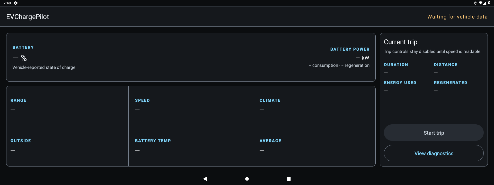
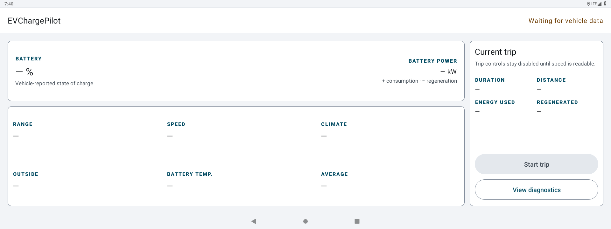

# EVChargePilot

[](https://github.com/malys/EVChargePilot/actions/workflows/tests.yml)
[](https://github.com/malys/EVChargePilot/actions/workflows/security.yml)
[](https://github.com/malys/EVChargePilot/actions/workflows/unstable.yml)
[](https://github.com/malys/EVChargePilot/releases)
[](LICENSE)
[](https://malys.github.io/EVSuite_site/)

> ⚠️ **This app is a read-only dashboard, but it is used on a car: never operate it while driving, and
> never rely on it alone for a range or charging decision.** Telemetry may be wrong, delayed or
> unavailable. Read [DISCLAIMER.md](DISCLAIMER.md) before installing. No warranty, no liability.
> MG and MG4 are third-party marks used only to identify compatibility; this independent
> project is not affiliated with or approved by SAIC Motor or MG Motor.

Read-only live energy dashboard and local trip analyser for the SAIC MG4 head unit.

EVChargePilot is **independent**. It reads the vehicle through the shared
[EVHardware](https://github.com/malys/EVHardware) layer and needs no other EVSuite app installed.

## Part of EVSuite

EVChargePilot is one app of [**EVSuite**](https://malys.github.io/EVSuite_site/), a family of independent,
offline-first apps for the MG4 head unit (Android Automotive OS 9). Each app installs on its
own — pick only what you need. User guides and install instructions:
<https://malys.github.io/EVSuite_site/>.

Discover the rest of the suite:

[](https://github.com/malys/EVProfile)
[](https://github.com/malys/EVTasker)
[](https://github.com/malys/EVABRPUploader)
[](https://github.com/malys/EVLauncher)
[](https://github.com/malys/EVSwipe)
[](https://github.com/malys/EVHardware)

---

## Contents

- [Part of EVSuite](#part-of-evsuite)
- [Screenshots](#screenshots)
- [Overview](#overview)
- [How it works](#how-it-works)
- [Requirements](#requirements)
- [Features](#features)
- [Trip export formats](#trip-export-formats)
- [Configuration](#configuration)
- [Install](#install)
- [Building](#building)
- [Project documents](#project-documents)
- [Security](#security)
- [Contributing](#contributing)
- [Legal](#legal)

## Screenshots

<p align="center">
  
  
</p>

## Overview

EVChargePilot is an EVSuite application for Android Automotive OS 9. It reads typed,
firmware-aware vehicle capabilities from EVHardware and renders unavailable readings as `—`.
It does not write to the vehicle and contains no update code. Every dashboard, trip and
diagnostic screen works with no network at all; the route planner is the one feature that
uses one, with a key the driver supplies, and it carries a route and never vehicle data
(see [SECURITY.md](SECURITY.md) and `analysis/CP-043_network_and_location.md`).

## How it works

EVHardware's `EnergyTelemetryReader` produces one coherent nullable snapshot per second.
Battery power is not integrated into normal trip history, and every dashboard calculation
derived from it remains unavailable, until the checked-in evidence catalogue validates the
signal's scale and sign on that exact firmware generation. A trusted energy summary stores the
exact firmware and conversion version as a small metadata tag; legacy and mismatched totals are
excluded from adaptive models. The bounded unstable CP-003 recorder is the separate raw-evidence
path used to establish that validation. It stores aggregated signal statistics rather than a raw
sample stream and retains only the eight newest app-private JSON files.
The dashboard states `+` battery output and `−` regeneration/charging in text as well as on a
static centred scale; it never animates that passive display while driving.
The thermal/climate block is likewise passive and keeps each field independently nullable, so a
firmware that publishes only part of the climate snapshot still shows the usable readings and an
explained `—` for every gap. Battery temperature remains hidden as unvalidated until CP-003 proves
its unit and semantics for the exact firmware generation. HVAC and AC indicators describe state
only: the vehicle has not supplied an HVAC power measurement, and the app does not infer one.
Its shared `TripDetector` starts after five continuous seconds at or above 5 km/h and stops
after 120 continuous seconds at or below 1 km/h, with park or charge-port confirmation when
either signal exists. Missing speed and observation gaps over five seconds invalidate partial
evidence rather than inventing a boundary. `EnergyTripAccumulator` likewise rejects integration
gaps longer than five seconds, and `EnergyTripHistoryStore` writes a bounded history through a
unique temporary file and atomic rename.

Automatic detection is enabled by default. A foreground service owns the sampler so detection
and recording continue when the driver opens another app. On firmware where speed stays
unavailable, ten consecutive misses suspend idle background polling; opening the dashboard
performs a bounded retry. Active trips remain fail-closed and under manual control. The unstable build keeps every automatically detected trip with a positive trustworthy
distance. The shared store still caps history at 200 trips and 2 MiB, discarding oldest
sample tracks before oldest summaries. Each successful save refreshes the local model.
Manual recordings are always kept. A trip's reported duration is the time actually covered by usable samples, not wall clock: a suspended
sampler adds nothing to duration, distance or energy, so consumption averages compare values
measured over the same interval.

The diagnostics dialog exports one self-contained ZIP to a removable USB volume: runtime/APK and
signer identity, exact firmware, service and last-sample state, property/provenance probes,
bounded recent log, previous crash, and up to eight newest unstable CP-003 evidence JSON files.
Its manifest records byte counts and SHA-256 per artifact. The app offers every volume it can
already list except primary emulated storage, and can fall back only to its own folder on the
volume that was chosen; it never writes to internal AAOS storage and declares no storage
permission. Export requires a
fresh readable speed at or below 0.1 km/h, runs off the main thread, caps the text report at
128 KiB, each evidence file at 64 KiB and the ZIP at 768 KiB, then atomically renames a synced
temporary file on USB. No archive copy accumulates on AAOS.

## Requirements

- SAIC MG4 head unit running Android Automotive OS 9 or a compatible test device.
- Android API 28 or newer.
- Platform signing for privileged car-property permissions where required by the firmware.

## Features

- Vehicle-reported SOC and range.
- A grouped thermal/climate state block: outside, cabin and evidence-gated battery
  temperatures; HVAC, AC, auto, econ and recirculation states; fan level/maximum; and
  driver/passenger targets when each signal is available.
- Automatic trip detection plus parked-only manual controls and configuration.
- Distance and duration calculated locally.
- Evidence-gated signed battery power with a static traction/regeneration scale.
- Pack temperature and charging state when exposed by the current firmware.
- Energy and regeneration integration from the shared EVHardware power convention.
- Parked-only, bounded diagnostic/evidence ZIP to an explicitly chosen removable USB volume.
- Atomic, app-private trip history and in-app crash diagnostics.
- Charge on arrival from the head unit's own guidance, with no network and no key.
- A parked-only charging-stop plan: type a destination, and the app answers whether the trip
  needs a charging stop and in how many kilometres. It needs an OpenRouteService key you supply
  (see [Configuration](#configuration)); without one, every other screen still works.
- On that same plan: what slowing down would change. Where the road ahead is fast, the app
  shows what 130, 120, 110, 100 and 90 km/h would save in charge and cost in minutes, and
  names the mildest slowdown that removes the charging stop. A second road comes back with the
  same request and is compared on distance, time and charge. It never recommends a speed.
- A battery page: the pack's state of health measured rather than declared, how long since its
  charge gauge last had a full charge to anchor itself on, what the pack has been subjected to,
  and what the last charge cost — points gained, duration, and approximate energy and mean power
  where this app watched the whole session. Read-only, like every other screen: no charge limit,
  no schedule, no preheat.

Every signal remains best-effort: unsupported or unreadable properties are displayed as `—`,
never zero. Charger data and energy-source attribution remain outside this initial milestone.

## Trip export formats

The trip history can export one trip or the full bounded ledger without network or storage
permission. Exports are written atomically under the app-private `files/exports/` directory;
the completed absolute path is shown in the app for an explicit `adb pull`. **Share file** opens
Android's chooser with temporary read access to that one file through `FileProvider`.

CSV contains summary rows only, in this exact order:

```text
started_at_utc,ended_at_utc,recorded_duration_seconds,distance_km,start_soc_percent,end_soc_percent,consumed_kwh,regenerated_kwh,average_consumption_kwh_per_100km,battery_power_firmware,battery_power_conversion_version
```

Times are ISO-8601 UTC, duration is seconds, distance is kilometres, SOC is percent, energy is
kWh, and average consumption is kWh/100 km. The last two columns name the exact validation
evidence behind power totals; legacy/unvalidated trips leave them empty. An unavailable value is
an empty cell, never `0`.

JSON export schema version 2 contains `exportedAtUtc` and the complete stored trip objects:
each summary plus its retained sample track. `batteryPowerEvidence` carries `firmware` and
`conversionVersion`, or is `null` for legacy/unvalidated totals. Other unavailable nullable
readings are likewise explicit `null`.
Both formats are limited to the history ceiling of 200 trips and 2 MiB per export. The export
directory retains the eight newest generated files so repeated exports cannot grow without bound.

## Configuration

Automatic trip detection is enabled by default. Its switch, and the manual start/stop action,
can be changed only while the vehicle reports zero speed. If speed is unavailable, the controls
fail closed and the dashboard explains why.

Unstable shows the live eco-advice line by default so a fresh install starts learning without a
setup step. Stable keeps that line opt-in. Spoken advice remains opt-in in both channels.

### Routing key

The charging-stop screen needs a routing service, and **no key ships inside the APK** — a
published APK is a zip, so a key in it is not a secret. Get a free key from
[openrouteservice.org](https://openrouteservice.org/), then either type it under
**Charging stop → Routing key**, or drop `evchargepilot-settings.json` on a USB stick and use
**Import from USB**:

```json
{
  "format": "evchargepilot-settings",
  "version": 1,
  "routing": {
    "ors_api_key": "your-key-here",
    "ors_base_url": "https://api.heigit.org"
  }
}
```

Import browses the stick — pick the volume, walk into folders, tap the file. The file may have
any name; it is read by its contents, not by its name, and the `key = value` file earlier
versions exported is still read, so a stick already in the glovebox keeps working. `ors_base_url` is optional and exists
so a self-hosted instance works without a code change — it must be `https`, with no credentials
and no query. The default is HeiGIT's own host: `api.openrouteservice.org` was deprecated on
2026-04-28, cut to a tenth of its quota on 2026-08-27 and switches off on 2026-09-28, so a
config file still naming it will stop working. The key is stored encrypted through the Android keystore, is never displayed
again, never written to a log, and never included in a diagnostic export.

**Export to USB** writes every setting you own back out, as `evchargepilot-settings.json` on the
USB folder you browse to — for a second car, after a factory reset, or for the unstable channel,
which keeps its own separate configuration. One file carries the API keys and base URLs, your
saved destinations, and your vehicle and battery figures, so setting a second car up is one
import rather than four screens. Sections the file leaves out are left alone rather than reset,
so importing a file that carries only a key does not blank a self-hosted base URL or a measured
pack. It is the one way the keys leave the car, it happens only when you ask for it while
parked, and the file holds them in clear text: from then on the stick is the secret. The file
says so in its own `note` field.

Free-tier allowances, as published by ORS: 2000 directions requests a day and 40 in any rolling
60 seconds, counted from your first request rather than from midnight. The app counts its own
requests and refuses before the server does, and every request follows a driver action — nothing
is on a timer.

Destination suggestions are the one request a driver does not tap for: while you type a place,
the app asks the geocoder what you might mean. It asks on a pause in typing, never per
keystroke, never under three letters and never twice for the same text — a handful of requests
per destination, out of a geocoding allowance assumed at 1000 a day. A destination you have
already saved is matched inside the car and costs nothing at all.

What leaves the car is the destination you type, the car's position and the road profile, to
the host configured above. Never a trip, an evidence capture, a diagnostic bundle, a charge
reading, a speed or an identifier. Route data comes from OpenStreetMap under ODbL and the
service's attribution is displayed with every route.

### Charger data key

Knowing a stop is due in 180 km is only half an answer; the other half is *where*. That comes
from [Open Charge Map](https://openchargemap.org/), which needs a second key of its own —
free, and again never shipped in the APK. Type it under **Charging stop → Charger key**, or
add it to the same USB file:

```
ocm_api_key  = your-other-key-here
ocm_base_url = https://api.openchargemap.io
```

Open Charge Map publishes no numeric rate limit — it asks for reasonable use and bans at its
own discretion — so the app imposes its own: 500 requests a day, 10 in any rolling minute, and
one request per plan, after a driver action.

What leaves the car is a 40 km stretch of the road before the planned stop, as an encoded
polyline, with a 5 km corridor. Not the origin, not the destination, not the route. The service
learns a piece of road; it does not learn the journey.

Charger records are shown with their data provider and the date the record was last confirmed,
because a charger dataset is out of date the day it is published and hiding that turns a
suggestion into a promise. User-contributed Open Charge Map data is CC BY 4.0; imported records
keep their original provider's licence, which is why the provider is named on screen next to
each charger. Both licences permit use in this app as long as the attribution is
displayed, and it is.

## Install

Install only a signed APK you trust, while the vehicle is parked. Stable releases do not
self-update.

## Building

With [mise](https://mise.jdx.dev/):

```bash
mise install
mise run bootstrap
mise run test
mise run build
```

### Layout

- `app/src/main/` — driver dashboard, lifecycle, presentation and diagnostics.
- `app/src/main/res/` — EVSuite driver interface.
- `EVHardware/` — shared vehicle abstraction, telemetry model, trip maths and storage.

### Emulator profiles

Android has no Automotive API 28 system image, so local validation uses two complementary
profiles. Neither replaces testing on every supported vehicle firmware:

```bash
mise run emulator-setup   # one-time image download and AVD creation
mise run emulator-car     # API 33 Automotive: car-service lifecycle
mise run emulator-screen  # API 28, 1920x1080 panel: target 1920x720 app viewport
mise run run              # build, install and launch on the connected device
mise run logs             # focused application and EVHardware logs
mise run emulator-stop
```

The emulators do not expose the MG4 vendor services or signals. Seeing `—` for unavailable
telemetry is the expected fail-safe behaviour, not simulated vehicle data.

Release signing reads `EV_KEYSTORE`, `EV_KEYSTORE_PASSWORD`, `EV_KEY_ALIAS` and
`EV_KEY_PASSWORD`, or their local `gradle.properties` equivalents. Never commit credentials.

## Project documents

| Document | What it covers |
| --- | --- |
| [DESIGN.md](DESIGN.md) | Normative EVSuite interface rules |
| [SECURITY.md](SECURITY.md) | Capability boundary and disclosure |
| [CONTRIBUTING.md](CONTRIBUTING.md) | Development expectations |
| [DISCLAIMER.md](DISCLAIMER.md) | Vehicle-safety disclaimer |
| [CHANGELOG.md](CHANGELOG.md) | Release history |

## Security

The application has no overlay, installer, boot or vehicle-write capability. Network and
location are declared for route planning alone (CP-043): what leaves the car is an origin, a
destination and a window of road, never telemetry, a trip or an identifier, over `https` to the
single host the driver configured. USB diagnostic export adds no broad storage permission and
writes only after an explicit parked user selects a volume, which is never primary emulated
storage.
Permission drift is blocked in CI. Report vulnerabilities according to [SECURITY.md](SECURITY.md).

## Contributing

See [CONTRIBUTING.md](CONTRIBUTING.md). Vehicle-facing changes require nullable failure paths,
JVM tests for decisions, and on-vehicle confirmation before release.

## Legal

Source-available under the PolyForm Noncommercial License 1.0.0. Commercial use is not
permitted. See [LICENSE](LICENSE) and [LICENSE.md](LICENSE.md).
